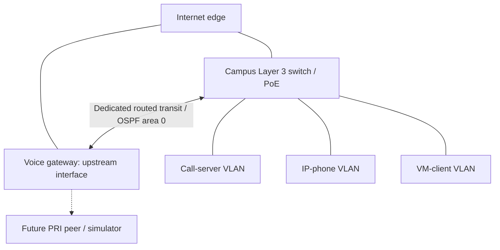

# Build OSPF Routing for Voice Network

Build a routed connection between a campus Layer 3 switch and a voice gateway, advertise the call-server subnet, and understand why signaling and voice media both need return routes.

**This is a generic learning template. All addresses below are documentation examples, not deployment addresses.** Replace them with unused private addresses before configuring a connected lab. The example configurations are not claimed as executed results.

## Topology



The switch owns the campus VLAN gateways. The edge provides Internet access. The voice gateway provides future PRI and media services. The campus Internet path remains independent of the voice gateway.

Two gateway links serve different roles: an existing upstream connection and a dedicated internal transit. Moving an upstream cable to an arbitrary switch port does not create a routed transit. Link up/up alone does not establish correct VLAN membership or IP reachability.

## Example addressing

| Purpose | Example |
|---|---|
| Call-server subnet / switch SVI | 192.0.2.0/24 / 192.0.2.1 |
| Call-server test destination | 192.0.2.10 |
| Phone subnet / switch SVI | 198.51.100.0/24 / 198.51.100.1 |
| Transit network | 203.0.113.0/30 |
| Switch transit / gateway transit | 203.0.113.1 / 203.0.113.2 |
| Switch loopback / gateway loopback | 203.0.113.101/32 / 203.0.113.102/32 |

Documentation prefixes are reserved for examples: [RFC 5737](https://www.rfc-editor.org/rfc/rfc5737). In an actual connected lab, select nonoverlapping [RFC 1918 private addresses](https://www.rfc-editor.org/rfc/rfc1918). Do not assign public addresses you do not own, including public DNS addresses, to router loopbacks.

The /30 has two usable endpoints. A /32 loopback provides a stable device address; advertising it supplies reachability. An OSPF router ID alone is an identifier, not a route.

## Routing choices

OSPF area 0 fits this small internal routing exercise. Use one neighbor relationship on the transit, advertise only the call-server campus subnet, and advertise both loopbacks. Keep the existing Internet defaults intact. Do not redistribute all connected networks or originate a default route for this exercise.

All OSPF interfaces are passive by default; the transit is the sole exception. The call-server SVI advertises its subnet without sending Hellos toward servers.

## Preflight

Capture the current configuration and inspect:

```text
show version
show ip interface brief
show ip route
show running-config | section router
```

On the switch, also inspect the selected physical port, existing Loopback0 and routing status:

```text
show running-config interface GigabitEthernet2/0/2
show running-config interface Loopback0
show running-config | include ^ip routing
```

On the gateway:

```text
show running-config interface GigabitEthernet0/1
show running-config interface Loopback0
```

The examples assume unused transit ports, no existing OSPF process 1, no existing Loopback0 and an already configured call-server SVI. Confirm the hardware interface names and feature support. Stop if any assumption differs; do not overwrite an existing routing process or loopback.

## Switch configuration

Replace addresses and interface names first. Enable Layer 3 routing only after reviewing the existing device role. These commands apply immediately.

```text
configure terminal
ip routing
interface GigabitEthernet2/0/2
 description TRANSIT_TO_VOICE_GATEWAY
 no switchport
 ip address 203.0.113.1 255.255.255.252
 no shutdown
exit
interface Loopback0
 description ROUTING_IDENTITY
 ip address 203.0.113.101 255.255.255.255
exit
router ospf 1
 router-id 203.0.113.101
 passive-interface default
 no passive-interface GigabitEthernet2/0/2
exit
interface GigabitEthernet2/0/2
 ip ospf network point-to-point
 ip ospf 1 area 0
exit
interface Loopback0
 ip ospf 1 area 0
exit
interface Vlan10
 ip ospf 1 area 0
end
```

This assumes Vlan10 already has the example server gateway 192.0.2.1/24 and is operational. It does not create DHCP, a voice VLAN or TFTP services.

## Voice-gateway configuration

```text
configure terminal
interface GigabitEthernet0/1
 description TRANSIT_TO_CAMPUS_SWITCH
 ip address 203.0.113.2 255.255.255.252
 no shutdown
exit
interface Loopback0
 description ROUTING_AND_FUTURE_RESOURCE_IDENTITY
 ip address 203.0.113.102 255.255.255.255
exit
router ospf 1
 router-id 203.0.113.102
 passive-interface default
 no passive-interface GigabitEthernet0/1
exit
interface GigabitEthernet0/1
 ip ospf network point-to-point
 ip ospf 1 area 0
exit
interface Loopback0
 ip ospf 1 area 0
end
```

## Every configuration command explained

| Command | Effect |
|---|---|
| configure terminal | Enters running-configuration editing mode. |
| ip routing | Enables Layer 3 forwarding on the switch. |
| interface ... | Selects an interface; creates a loopback if absent. |
| description ... | Documents purpose without changing forwarding. |
| no switchport | Converts the switch port to a routed interface rather than an access/trunk port. |
| ip address ... 255.255.255.252 | Assigns a /30 transit endpoint. |
| ip address ... 255.255.255.255 | Assigns a /32 loopback address. |
| no shutdown | Administratively enables the interface; peer/cable must also work. |
| router ospf 1 | Creates/selects OSPF process 1; process ID is locally significant. |
| router-id ... | Sets the unique OSPF identifier; does not itself advertise a route. |
| passive-interface default | Prevents neighbor formation by default while allowing enabled interfaces' networks to be advertised. |
| no passive-interface ... | Enables neighbor formation on the transit. |
| ip ospf network point-to-point | Avoids DR/BDR election on the two-device transit; configure both ends consistently. |
| ip ospf 1 area 0 | Enables the interface in OSPF process 1, area 0. |
| exit | Returns one configuration level. |
| end | Returns to privileged EXEC mode. |

Changing a router ID on an already active process can require a process restart. This template starts new processes. No restart is part of the example.

## Verification

Switch:

```text
ping 203.0.113.2
show ip ospf neighbor
show ip route ospf
ping 203.0.113.102 source 192.0.2.1
```

Gateway:

```text
ping 203.0.113.1
show ip ospf neighbor
show ip route ospf
ping 192.0.2.1 source Loopback0
ping 192.0.2.10 source Loopback0
```

| Check | Expected result |
|---|---|
| Transit ping | Direct IP connectivity passes. |
| show ip ospf neighbor | Neighbor reaches FULL/- on the transit. |
| Gateway OSPF routes | Server /24 and switch loopback /32 learned through switch transit address. |
| Switch OSPF routes | Gateway loopback /32 learned through gateway transit address. |
| Source-specific ping | Destination path and return route to the selected source work. |
| Server endpoint ping | Checks beyond the switch SVI; filtering may affect ICMP. |

FULL means adjacency synchronization completed. The dash denotes no DR/BDR role on the point-to-point relationship. OSPF routes show administrative distance and metric; actual costs depend on configuration. The switch retains its own server subnet as a connected route rather than an OSPF-learned route.

To inspect a failed adjacency, use:

```text
show ip ospf interface GigabitEthernet0/1
```

Use the switch's corresponding transit interface name on that device.

## Signaling and media require different destination routes

A phone first needs provisioning and call-control reachability. When a gateway MTP or transcoder is inserted, it also needs bidirectional RTP reachability to that resource. CUCM signaling success does not prove audio works.

| Traffic | Required reachability |
|---|---|
| Phone provisioning / registration | Phone to configured DHCP, TFTP and call-control services |
| Gateway or media-resource control | Gateway source address to call server, with a return route |
| RTP with an inserted resource | Phone or other media peer to gateway media address, in both directions |

If the call server uses a different router as its default gateway, that router must know the return route to the voice-gateway resource address. Check its route before adding anything. Do not change the call server's gateway merely to repair one missing route.

Advertising only the server subnet leaves the phone subnet outside OSPF. Before media tests, one option is an explicit gateway static route through the campus switch:

```text
ip route 198.51.100.0 255.255.255.0 203.0.113.1
```

This is a later-phase example. Replace addresses, check existing routes, and verify the actual phone gateway and media-source address. Alternatively, intentionally add the phone SVI to OSPF when expanding the routing scope.

No NAT is needed on the internal transit. Review existing ACLs/NAT so they do not block or translate internal control/media traffic unexpectedly.

## Save and rollback

After checks pass on both devices:

```text
copy running-config startup-config
```

Accept the default destination by pressing Enter. Alternatively:

```text
write memory
```

Confirm successful completion. A save error is not success; correct it before leaving.

For rollback, restore the captured preflight configuration. In this fresh-process template, remove interface OSPF activation, remove the new process, remove the new loopbacks, and remove/shut the transit addresses. On the switch restore its prior switchport mode. Preserve pre-existing SVIs, upstream interfaces and default routes. Remove later static routes with matching no ip route commands. Do not remove a process or loopback that has acquired other uses.

## Troubleshooting

| Symptom | Investigation |
|---|---|
| Link down | Cable, selected ports, peer power, shutdown state |
| Link up but ping fails | Address/mask, VLAN versus routed-port mode, ACL |
| No neighbor | Area, interface activation, passive exception, timers, authentication, protocol 89 filtering |
| EXSTART/EXCHANGE persists | MTU and packet exchange |
| FULL but server route absent | Server SVI state, OSPF activation, LSDB and routing table |
| SVI reachable but server unreachable | Endpoint state, gateway, return route, filtering |
| Phone registers but no/one-way audio | RTP routes, media address, ACL/NAT, codec negotiation, resource allocation |

## Next: PRI and media resources

Verify call-server endpoint reachability, then deploy the phone and confirm DHCP/TFTP/registration. Establish phone-media routing before adding resources.

For an ISR3945E, inspect IOS, licenses, installed voice cards and DSPs:

```text
show version
show license
show inventory
show voice dsp group all
```

A UC license does not supply physical DSP hardware. Verify healthy PVDM resources before hardware transcoding, conferencing or MTP. Software MTP is a distinct capability. CUCM-controlled IOS DSP farms use SCCP registration independently of a phone's SIP signaling.

PRI requires a suitable TDM card and peer/simulator, with matching framing, line coding, clocking and signaling. A phone is an Ethernet endpoint; PRI is the gateway's TDM connection.

Different codec preferences do not guarantee transcoding. Verify negotiated codecs, CUCM media-resource selection and active DSP sessions, then capture signaling and RTP.

## Cisco references

- [OSPF configuration](https://www.cisco.com/c/en/us/td/docs/routers/ios/config/17-x/ip-routing/b-ip-routing/m_iro-cfg-0.html)
- [Default passive interfaces](https://www.cisco.com/c/en/us/td/docs/routers/ios/config/17-x/ip-routing/b-ip-routing/m_iri-default-passive-interface.html)
- [ISR G2 PVDM3 configuration](https://www.cisco.com/c/en/us/td/docs/routers/access/1900/software/configuration/guide/Software_Configuration/pvdm3_config.html)
- [IOS conferencing and transcoding](https://www.cisco.com/c/en/us/td/docs/ios-xml/ios/voice/cminterop/configuration/15-mt/cminterop-15-mt-book/vc-enh-confr-vgr.html)
