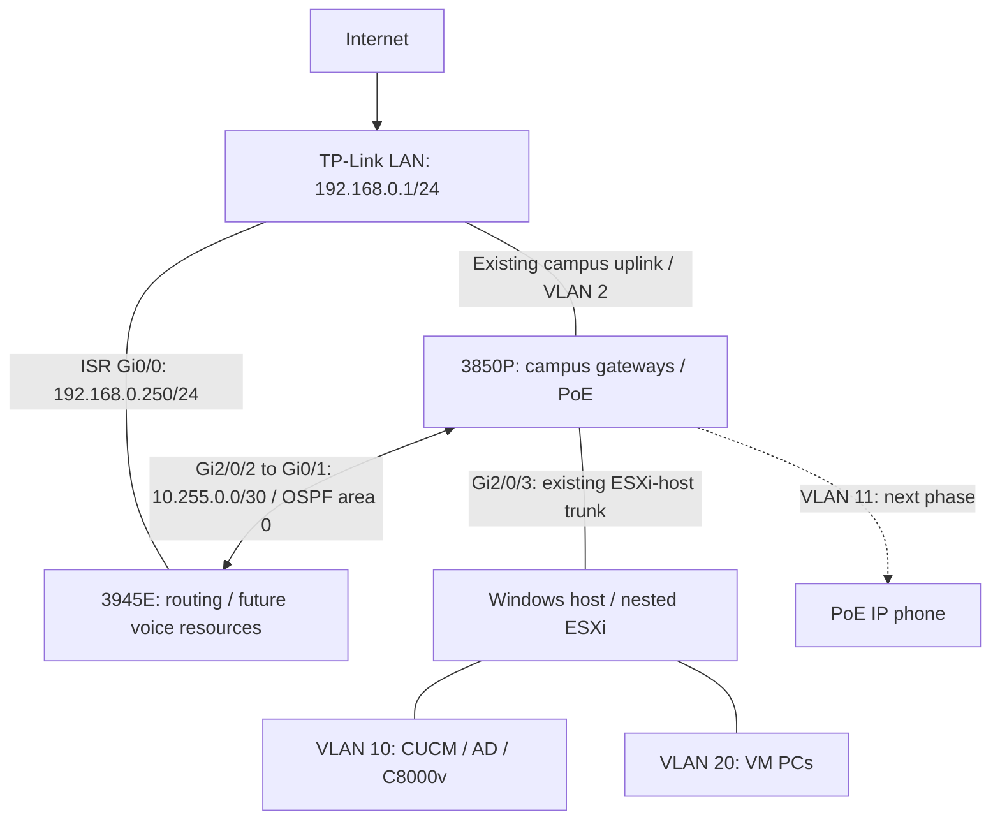

# Build OSPF Routing for Voice Network

A practical Cisco Catalyst 3850P and ISR3945E lab: build a dedicated routed link, exchange the call-server subnet with OSPF, and verify the foundation for later PRI, transcoding and Media Termination Point (MTP) exercises.

**Validated on 4 October 2026:** OSPF adjacency, server-subnet route exchange, loopback reachability and configuration saves. CUCM endpoint reachability, phone registration, PRI and DSP/media services are subsequent tests—not completed results.

## 1. Start with the topology



Solid links show the established architecture. The phone is a planned addition. The two ISR connections have separate jobs: Gi0/0 retains the TP-Link upstream connection, while Gi0/1 provides the dedicated campus routing and voice-resource path.

The 3850 remains the campus gateway. TP-Link remains the Internet edge. The ISR supplements the campus with routing and future voice services; ordinary PC/ESXi connectivity does not depend on powering it on.

### Physical connections

| From | To | Role |
|---|---|---|
| TP-Link LAN | 3850 existing upstream port (baseline Gi2/0/1, access VLAN 2; verify locally) | Campus upstream |
| TP-Link LAN | ISR Gi0/0 | ISR upstream |
| 3850 Gi2/0/2 | ISR Gi0/1 | Dedicated routed transit |
| 3850 Gi2/0/3 | Windows physical NIC / VMware bridge / nested ESXi | Existing host trunk |
| Available 3850 PoE port | IP phone | Next phase; configure voice VLAN and provisioning |

Preserve the existing host trunk and bridge settings. Its native VLAN 2 reaches nested ESXi management untagged, so the established ESXi Management Network VLAN ID remains **0**. Check the current allowed-VLAN list separately before carrying additional VM VLANs.

### Why moving the upstream cable initially failed

ISR Gi0/0 retained 192.168.0.250/24 when moved from TP-Link to an unconfigured switch port. The link became up/up, but IP connectivity failed. This is consistent with the switch port's VLAN not matching the VLAN 2 upstream segment. The earlier outputs did not prove its operational VLAN.

**Up/up proves link operation, not the correct VLAN, subnet or return route.** The final design uses a separate cable and a routed switch port for the transit.

## 2. Addressing and responsibilities

| Network or interface | Address | Responsibility |
|---|---|---|
| TP-Link LAN | 192.168.0.1/24 | Existing Internet edge |
| 3850 VLAN 2 | 192.168.0.3/24 | Campus upstream/management segment |
| ISR Gi0/0 | 192.168.0.250/24 | Existing upstream |
| Server VLAN 10 | 192.168.10.0/24; SVI 192.168.10.1 | CUCM and infrastructure |
| Physical voice VLAN 11 | 192.168.11.0/24; SVI 192.168.11.1 | Hardphones; outside OSPF in this phase |
| Data VLAN 20 | 192.168.20.0/24; SVI 192.168.20.1 | VM PCs; outside OSPF in this phase |
| 3850 Gi2/0/2 | 10.255.0.1/30 | Transit endpoint |
| ISR Gi0/1 | 10.255.0.2/30 | Transit endpoint |
| 3850 Loopback0 | 10.255.255.1/32 | Stable routing identity |
| ISR Loopback0 | 10.255.255.2/32 | Stable identity; candidate future voice-resource source |
| CUCM publisher / subscriber | 192.168.10.150 / 192.168.10.151 | Call control / TFTP services |
| AD/DNS/DHCP server | 192.168.10.157 | Infrastructure |
| Existing C8000v server interface | 192.168.10.2 | Recorded CUCM default gateway; verify return routing |

The /30 contains network address 10.255.0.0, two usable endpoints .1 and .2, and broadcast .3. Loopbacks use individual /32 host addresses.

Use private addresses on this connected lab. The ISR's old 8.8.8.8 loopback was replaced: assigning a real public DNS address locally makes the router treat that destination as itself.

## 3. OSPF design

- One OSPF process per device, process ID 1, area 0.
- One neighbor relationship, exclusively across the transit.
- Point-to-point OSPF network type on both transit endpoints.
- VLAN 10 is the only advertised campus subnet.
- Both loopbacks are advertised for bidirectional reachability.
- All interfaces are passive by default; only the transit sends OSPF Hellos.
- Both existing static defaults remain toward 192.168.0.1.
- No default-route origination and no connected/static redistribution.

OSPF is a suitable internal routing exercise here. EIGRP, IS-IS and BGP can be studied later with topologies that demonstrate their particular roles; MPLS is a forwarding/VPN technology rather than a substitute routing protocol.

The process ID is locally significant; the router ID must be unique. Setting a router ID alone does **not** create a reachable IP address—the loopback address and its advertisement do that.

## 4. Preflight

Current state: 3850 routes the campus VLANs, Gi2/0/2 has no custom configuration, ISR Gi0/1 has no IP, and both devices have a static Internet default through TP-Link.

Check for address overlap, port use, existing ACLs and platform/feature support before applying the example:

```text
show ip interface brief
show ip route
show running-config | section router
show version
```

On the switch:

```text
show running-config interface GigabitEthernet2/0/2
show running-config interface Loopback0
show running-config | include ^ip routing
show interfaces trunk
```

On the ISR:

```text
show running-config interface GigabitEthernet0/1
show running-config interface Loopback0
show running-config | include 8.8.8.8
```

In this lab the old ISR OSPF process was deliberately removed with `no router ospf 1`. That also removed its router ID and network statements. Do not remove a production routing process merely to copy this exercise.

**Stop** if a proposed address is already used, the transit port serves another device, or a configuration command is rejected. Capture the error and resolve the mismatch first.

## 5. Configure the 3850P

The switch already has `ip routing` enabled and the existing VLAN SVIs configured.

```text
configure terminal
interface GigabitEthernet2/0/2
 description ROUTED_TRANSIT_TO_ISR3945E_Gi0/1
 no switchport
 ip address 10.255.0.1 255.255.255.252
 no shutdown
exit
interface Loopback0
 description OSPF_ROUTER_ID
 ip address 10.255.255.1 255.255.255.255
exit
router ospf 1
 router-id 10.255.255.1
 passive-interface default
 no passive-interface GigabitEthernet2/0/2
exit
interface GigabitEthernet2/0/2
 ip ospf network point-to-point
 ip ospf 1 area 0
exit
interface Loopback0
 ip ospf 1 area 0
exit
interface Vlan10
 ip ospf 1 area 0
end
```

## 6. Configure the ISR3945E

Gi0/0 and the existing static default stay as configured.

```text
configure terminal
interface GigabitEthernet0/1
 description ROUTED_TRANSIT_TO_3850P_Gi2/0/2
 ip address 10.255.0.2 255.255.255.252
 no shutdown
exit
interface Loopback0
 description OSPF_ID_AND_FUTURE_VOICE_RESOURCE_SOURCE
 no ip address 8.8.8.8 255.255.255.255
 ip address 10.255.255.2 255.255.255.255
exit
router ospf 1
 router-id 10.255.255.2
 passive-interface default
 no passive-interface GigabitEthernet0/1
exit
interface GigabitEthernet0/1
 ip ospf network point-to-point
 ip ospf 1 area 0
exit
interface Loopback0
 ip ospf 1 area 0
end
```

### What each configuration command does

| Command | Meaning and effect |
|---|---|
| `configure terminal` | Enters running-configuration editing mode; changes apply immediately. |
| `interface ...` | Selects the interface being configured; selecting Loopback0 creates it if absent. |
| `description ...` | Documents the connection or role; does not change forwarding. |
| `no switchport` | Converts the switch port to a Layer 3 interface; it no longer uses access/trunk VLAN membership. |
| `ip address ... 255.255.255.252` | Assigns a /30 transit endpoint and creates connected/local routes when operational. |
| `no shutdown` | Administratively enables the interface; a working cable/peer is still required. |
| `ip address ... 255.255.255.255` | Assigns a /32 loopback host address. |
| `no ip address 8.8.8.8 ...` | Removes the old loopback address; references to it must be checked beforehand. |
| `router ospf 1` | Creates/selects local OSPF process 1. |
| `router-id ...` | Explicitly sets the unique OSPF identity. This example starts fresh processes; changing an active process's ID may require a process restart. |
| `passive-interface default` | Suppresses OSPF neighbor formation on interfaces by default; enabled passive interfaces can still advertise their networks. |
| `no passive-interface ...` | Allows Hellos and adjacency formation on the transit. |
| `ip ospf network point-to-point` | Sets point-to-point OSPF behavior; no DR/BDR election on this link. Match both ends. |
| `ip ospf 1 area 0` | Enables process 1 on the selected interface in area 0. On passive VLAN10 this advertises the server subnet without forming server-side neighbors. |
| `exit` | Returns one configuration level. |
| `end` | Returns to privileged EXEC mode. |

No NAT is introduced on the internal transit. Check existing NAT rules later so campus/media traffic is not inadvertently translated.

## 7. Verify the routing foundation

### Switch checks

```text
ping 10.255.0.2
show ip ospf neighbor
show ip route ospf
ping 10.255.255.2 source 192.168.10.1
```

### ISR checks

```text
ping 10.255.0.1
show ip ospf neighbor
show ip route ospf
ping 192.168.10.1 source Loopback0
```

| Command | What it proves |
|---|---|
| Transit ping | Direct IP connectivity across the /30; alone it does not prove OSPF. |
| `show ip ospf neighbor` | Neighbor identity, interface and adjacency state. |
| `show ip route ospf` | OSPF routes selected into the routing table. |
| Source-specific ping | Tests the return route to the chosen source as well as the destination path. |
| `show ip ospf interface ...` | Useful follow-up for area, timers, network type and interface OSPF status. |

### Actual observed results

Switch neighbor:

```text
Neighbor ID     Pri   State       Address       Interface
10.255.255.2      0   FULL/-      10.255.0.2    GigabitEthernet2/0/2
```

Switch learned route:

```text
O 10.255.255.2/32 [110/2] via 10.255.0.2, GigabitEthernet2/0/2
```

ISR neighbor:

```text
Neighbor ID     Pri   State       Address       Interface
10.255.255.1      0   FULL/-      10.255.0.1    GigabitEthernet0/1
```

ISR learned routes:

```text
O 10.255.255.1/32 [110/2] via 10.255.0.1, GigabitEthernet0/1
O 192.168.10.0/24 [110/2] via 10.255.0.1, GigabitEthernet0/1
```

Both transit pings passed 5/5. Switch-to-ISR-loopback ping sourced from 192.168.10.1 passed 5/5. ISR-to-192.168.10.1 ping sourced from Loopback0 passed 5/5.

`FULL/-` means the adjacency is fully established and no DR/BDR role applies to this point-to-point relationship. In `[110/2]`, 110 is administrative distance and 2 is the observed OSPF metric; other interface costs can produce different metrics.

The switch does not display VLAN10 as an OSPF-learned route because it already owns that subnet as a connected route.

### Save after verification

On both devices:

```text
copy running-config startup-config
```

Press Enter at `Destination filename [startup-config]?`.

Alternatively:

```text
write memory
```

Both devices returned `[OK]` using `write memory`. An earlier ISR copy attempt returned a filename error; the later successful save confirmed persistence.

## 8. Why server routes alone do not finish a voice network

There are three separate reachability requirements:

| Traffic | Required path | Status |
|---|---|---|
| Phone provisioning and registration | Phone ↔ DHCP/TFTP/CUCM, according to configuration | Pending phone deployment |
| Gateway/media-resource control | ISR resource source ↔ CUCM, bidirectionally | Server subnet learned; CUCM endpoint tests pending |
| Voice media when an ISR resource is inserted | Phone/CUBE ↔ ISR media address, bidirectionally | Phone/data subnet routes pending |

A phone can register successfully yet have one-way or no audio. RTP commonly flows between endpoints or inserted media resources rather than through CUCM's call-control service. OSPF supplies IP reachability; it does not register a phone, select a codec or configure a DSP.

### Verify CUCM's return path first

Recorded CUCM gateway: C8000v **192.168.10.2**, while the switch server SVI is **192.168.10.1**. Verify that current gateway before changes.

The ISR knows how to reach CUCM through the switch. CUCM's gateway must also know how to return to the ISR loopback. On C8000v check:

```text
show ip route 10.255.255.2
```

If no suitable route exists, a targeted static route is one option **after checking current routing**:

```text
ip route 10.255.255.2 255.255.255.255 192.168.10.1
```

This is a conditional next-phase example, not a verified/applied change. Do not change CUCM's gateway just to fix one missing return route.

Then test from ISR:

```text
ping 192.168.10.150 source Loopback0
ping 192.168.10.151 source Loopback0
```

ICMP success is an IP-path check; service and ACL tests still matter. ICMP failure alone does not prove a service is unreachable.

### Keep VLAN11 outside OSPF, but provide a media route

The current ISR has no specific route to 192.168.11.0/24. Its default would send that traffic toward TP-Link. To preserve the selected OSPF scope, a later explicit static route can direct hardphone traffic through the transit:

```text
ip route 192.168.11.0 255.255.255.0 10.255.0.1
```

For later VM-softphone media tests, the analogous route is:

```text
ip route 192.168.20.0 255.255.255.0 10.255.0.1
```

These routes are **planned, not validated** in this tutorial. The switch already knows those networks directly and learns the ISR loopback through OSPF. Verify endpoint gateways, ACLs and the actual media source address before testing calls. Avoid relying on an accidental path through the home router.

## 9. Troubleshooting and rollback

| Symptom | Check / action |
|---|---|
| Transit down/down | Cable, correct physical ports, peer power. |
| Administratively down | Interface shutdown state. |
| Transit ping fails | /30 addresses/masks, routed-port conversion, ACLs, interface state. |
| No OSPF neighbor | Transit OSPF activation, passive exception, area, timers, authentication and protocol 89 filtering. |
| Neighbor stuck in EXSTART/EXCHANGE | Inspect MTU mismatch and packet exchange before changing settings. |
| FULL but no server route | VLAN10 up/up, interface OSPF activation, routing table and LSDB. |
| Gateway ping works, CUCM fails | CUCM status, its actual gateway and return route, filtering. |
| Phone registers but media fails | Phone-subnet route, media address, RTP filtering, NAT and DSP allocation. |
| Command rejected | Platform, IOS version, feature/license support and configuration mode. Stop and investigate. |

Rollback removes this lab's new OSPF participation, addresses and descriptions. Preserve the existing upstream interfaces, SVIs and default routes.

Switch:

```text
configure terminal
interface Vlan10
 no ip ospf 1 area 0
exit
interface Loopback0
 no ip ospf 1 area 0
exit
interface GigabitEthernet2/0/2
 no ip ospf 1 area 0
 no ip ospf network point-to-point
exit
no router ospf 1
no interface Loopback0
interface GigabitEthernet2/0/2
 shutdown
 no ip address
 no description
 switchport
end
```

ISR:

```text
configure terminal
interface GigabitEthernet0/1
 no ip ospf 1 area 0
 no ip ospf network point-to-point
exit
interface Loopback0
 no ip ospf 1 area 0
exit
no router ospf 1
interface GigabitEthernet0/1
 shutdown
 no ip address
 description GATEWAYS_TO_LAB
exit
interface Loopback0
 no ip address 10.255.255.2 255.255.255.255
 no description
end
```

This leaves the ISR loopback unnumbered rather than reinstating Google's public DNS address. If restoring an exact previous configuration is required, use your captured baseline and review its references first. Remove any later conditional static routes separately using their matching `no ip route ...` commands. Save only after verifying the intended rollback state.

## 10. Next phase: phone, PRI and DSP services

1. Validate CUCM endpoint return routing.
2. Configure a free PoE phone port, VLAN11 DHCP/gateway and TFTP provisioning, then verify phone registration.
3. Provide and test phone-to-ISR media reachability.
4. Inspect ISR IOS, UC/security licenses, voice interface cards and healthy PVDM/DSP inventory.
5. Determine PRI type, controller slot/port, peer or simulator, clocking and signaling before configuring the gateway.
6. Configure and register the selected CUCM media resources, then test controlled codec scenarios and capture signaling/RTP.

Read-only ISR inventory checks:

```text
show version
show license
show inventory
show voice dsp group all
```

A UC license does not replace DSP hardware. Hardware transcoding/conferencing/MTP require suitable resources. Software MTP is a separate capability. A codec preference difference alone does not guarantee a transcoder is allocated: inspect negotiated codecs, CUCM resource selection and active DSP sessions.

For CUCM-controlled IOS DSP farms, SCCP resource registration is separate from the phone's SIP signaling. PRI is the gateway's TDM-side connection; the Ethernet phone itself is not a PRI endpoint.

## References

- [Cisco: OSPF configuration](https://www.cisco.com/c/en/us/td/docs/routers/ios/config/17-x/ip-routing/b-ip-routing/m_iro-cfg-0.html)
- [Cisco: Default passive interfaces](https://www.cisco.com/c/en/us/td/docs/routers/ios/config/17-x/ip-routing/b-ip-routing/m_iri-default-passive-interface.html)
- [Cisco: PVDM3 configuration for ISR G2](https://www.cisco.com/c/en/us/td/docs/routers/access/1900/software/configuration/guide/Software_Configuration/pvdm3_config.html)
- [Cisco: IOS conferencing and transcoding](https://www.cisco.com/c/en/us/td/docs/ios-xml/ios/voice/cminterop/configuration/15-mt/cminterop-15-mt-book/vc-enh-confr-vgr.html)

This is an educational lab using the supplied deployment and observed CLI evidence. Verify exact platform/version support before reproducing it.
